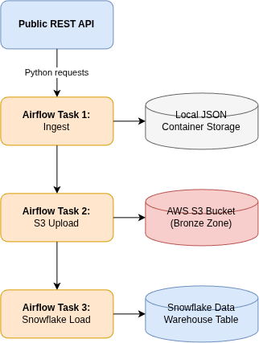

# 🚀 End-to-End Automated Data Engineering Pipeline

A production-grade, automated data pipeline built to orchestrate real-time API extraction, cloud data lake landing (AWS S3), and warehouse staging (Snowflake) using Apache Apache Airflow.

---

## 🏗️ Architecture & Tech Stack

This project implements the **Bronze Layer (Raw Landing)** of the modern Medallion Architecture, ensuring raw historical data remains untouched before downstream transformation.

* **Orchestration:** Apache Airflow (DAG dependency management)
* **Language:** Python 3.9+ (`requests`, `boto3`, `snowflake-connector-python`)
* **Cloud Storage:** Amazon S3 (Data Lake Object Storage)
* **Data Warehouse:** Snowflake
* **Containerization:** Docker & Docker Compose

## 🏗️ Pipeline Architecture Automation through Airflow

